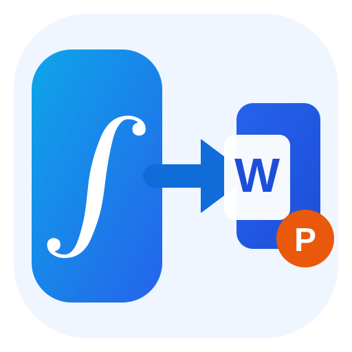

<div align="center">
  

# ChatGPT Office Math Copy

**Batch-copy ChatGPT text and multiple math formulas into Microsoft Word / PowerPoint — without copying formulas one by one.**

[](CHANGELOG.md)
[](LICENSE)
[](manifest.json)
[](PRIVACY.md)

[中文说明](README.zh-CN.md) · [Report a bug](../../issues/new?template=bug_report.md) · [Request a feature](../../issues/new?template=feature_request.md)
</div>

<div align="center">
  
</div>

## Why this exists

ChatGPT's web math renderer can display high-quality two-dimensional formulas, but ordinary browser copy/paste may flatten the mathematical structure before it reaches Microsoft Office. This project restores a practical workflow for researchers, students, engineers, and anyone who frequently moves technical content from ChatGPT into Word or PowerPoint.

Instead of clicking and copying each equation individually, **select an entire section containing prose, multiple formulas, numbering, and line breaks, then copy it once**.

<div align="center">
  
</div>

## Key features

- **Batch copy** — copy prose and multiple equations in one operation.
- **Editable Office math** — reconstructs formulas as Presentation MathML where possible, rather than images.
- **Selection-aware** — detects formulas that intersect the real browser selection instead of relying only on cloned DOM fragments.
- **Multiple math sources** — supports MathML, KaTeX, MathJax, TeX annotations, `data-latex`, `aria-label`, and fallback math-node scanning.
- **Scientific notation support** — fractions, superscripts/subscripts, roots, integrals, sums, Greek letters, common matrices/alignment environments, and more.
- **Local processing** — no telemetry, no analytics SDK, no remote conversion service, and no chat-content upload.
- **Diagnostic feedback** — reports how many formulas intersected the selection and how many were actually written to the clipboard.

## Workflow

**ChatGPT selection → locate all math nodes → extract/reconstruct math structure → build HTML + MathML clipboard payload → paste into Word / PowerPoint**

## Installation

### Option A — v1.0.0 release package

1. Download `chatgpt-office-math-copy-v1.0.0.zip` from the latest GitHub Release.
2. Extract it to a permanent folder.
3. Open `chrome://extensions/` in Chrome or another Chromium browser.
4. Enable **Developer mode**.
5. Click **Load unpacked**.
6. Select the extracted extension folder.
7. Refresh ChatGPT.

### Option B — clone the repository

```bash
git clone https://github.com/yunfei-z24/chatgpt-office-math-copy.git
```

Then load the repository root using **Load unpacked** in `chrome://extensions/`.

## Usage

1. Open ChatGPT in Chrome / Edge.
2. Select a section containing text and one or more equations.
3. Click **Copy selection to Office** in the lower-right corner.
4. Paste directly into Word or PowerPoint.

If there is no active selection, the extension attempts to use the most recent assistant response.

### Diagnostic toast

A successful batch operation may show:

> Batch copied: 3 formulas intersected, 3 formulas written (live DOM → MathML)

Interpretation:

- **3 / 3** — detection and replacement succeeded.
- **3 / 1** — formulas were found, but some could not be rebuilt into the clipboard payload.
- **1 / ...** — some ChatGPT formula nodes use an unsupported DOM structure.
- **0 / ...** — the current ChatGPT math renderer needs a new compatibility adapter.

## Compatibility

| Component | Status |
|---|---|
| Chrome / Chromium | Primary target |
| Microsoft Word | Supported target |
| Microsoft PowerPoint | Supported target |
| Inline math | Supported |
| Display math | Supported |
| Multiple formulas in one selection | Core feature |
| Complex custom TeX macros | Partial / best effort |

Office behavior can vary by version because clipboard HTML/MathML parsing is handled by Office itself.

## Privacy and permissions

The extension requests:

- `clipboardRead`
- `clipboardWrite`
- access to `https://chatgpt.com/*`
- access to `https://chat.openai.com/*`

The current source code contains **no remote API calls, telemetry, analytics SDKs, external conversion servers, or chat-content upload logic**. Processing is performed locally in the browser. See [PRIVACY.md](PRIVACY.md).

## Project structure

```text
.
├── assets/
│   ├── logo.svg
│   ├── overview.webp
│   └── demo.gif
├── content-core.js
├── content-dom.js
├── content-main.js
├── manifest.json
├── style.css
├── README.md
├── README.zh-CN.md
├── CHANGELOG.md
├── RELEASE_NOTES.md
├── PRIVACY.md
├── SECURITY.md
├── CONTRIBUTING.md
└── LICENSE
```

## Development

No build step is required.

After editing the source:

1. Open `chrome://extensions/`.
2. Click **Reload** on this extension.
3. Refresh the ChatGPT tab.

When reporting a compatibility bug, please include:

- browser version;
- Word / PowerPoint version;
- a screenshot of the selected ChatGPT content;
- the diagnostic toast values (`intersected / written`);
- a minimal reproducible formula if possible.

## Roadmap

- improve compatibility with future ChatGPT math DOM variants;
- make cross-node selection reconstruction more robust;
- broaden TeX → MathML coverage;
- tune clipboard output separately for Word and PowerPoint;
- add DOM fixture tests and regression cases;
- provide an optional debug inspector;
- expand the Chrome / Edge / Office compatibility matrix.

## Contributing

Issues and pull requests are welcome. See [CONTRIBUTING.md](CONTRIBUTING.md).

## Security

For security-sensitive reports, follow [SECURITY.md](SECURITY.md) instead of posting sensitive details publicly.

## License

Licensed under the **MIT License**. You may use, modify, redistribute, and integrate this project in personal, academic, or commercial work, provided that the copyright notice and license text are retained. See [LICENSE](LICENSE).

## Disclaimer

This is an independent open-source project. It is not affiliated with, endorsed by, or sponsored by OpenAI, ChatGPT, Microsoft, Word, or PowerPoint. All trademarks belong to their respective owners.
